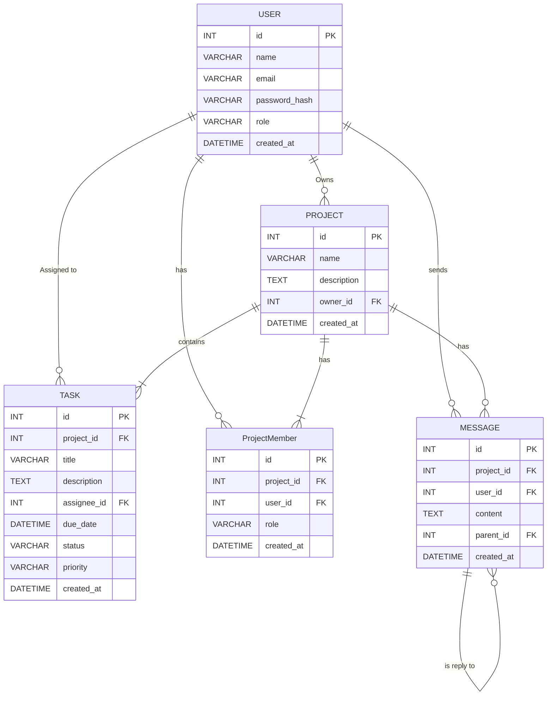

# EcoSwap - A Sustainable Second-Hand Marketplace


EcoSwap is a modern, full-stack web application that provides a platform for users to buy, sell, and swap pre-loved goods. It's built with a focus on sustainability, community, and a seamless user experience, powered by Next.js and generative AI features.

## ✨ Key Features

- **User Authentication**: Secure sign-up and login functionality.
- **Product Listings**: Users can create, edit, and delete their product listings.
- **Advanced Search & Filtering**: Easily find products with text search and category filters.
- **AI-Powered Image Enhancement**: Automatically improve the quality of product photos upon upload.
- **AI-Powered Chatbot**: An intelligent assistant to help users find products and answer questions.
- **Personalized Recommendations**: AI-driven suggestions for products based on user browsing history.
- **Shopping Cart**: A persistent shopping cart to manage items before checkout.
- **Fully Responsive**: A beautiful and functional UI that works on all devices, from mobile to desktop.

## 🛠️ Tech Stack

This project is built with a modern, production-ready tech stack:

- **Framework**: [Next.js](https://nextjs.org/) (App Router)
- **Language**: [TypeScript](https://www.typescriptlang.org/)
- **Styling**: [Tailwind CSS](https://tailwindcss.com/)
- **UI Components**: [ShadCN/UI](https://ui.shadcn.com/)
- **Generative AI**: [Google's Gemini via Genkit](https://firebase.google.com/docs/genkit)
- **Database**: Designed for use with **MongoDB**, **MySQL**, or **PostgreSQL**. (See Database Schema section)
- **Deployment**: [Vercel](https://vercel.com/) / [Firebase App Hosting](https://firebase.google.com/docs/app-hosting)

## 🗂️ Database Schema

The application is designed to run on a relational database like MySQL or PostgreSQL. The schema is organized into five main tables: `User`, `Project`, `Task`, `ProjectMember`, and `Message`.

### Entity Relationship Diagram


### Table Descriptions

#### 1. `User`
Stores information about the users of the platform.
-   `id` (INT, Primary Key): Unique identifier for each user.
-   `name` (VARCHAR): The user's full name.
-   `email` (VARCHAR): The user's email address, used for login.
-   `password_hash` (VARCHAR): Hashed password for security.
-   `role` (VARCHAR): User role (e.g., 'admin', 'member').
-   `created_at` (DATETIME): Timestamp of when the user account was created.

#### 2. `Project`
Stores information about each project.
-   `id` (INT, Primary Key): Unique identifier for each project.
-   `name` (VARCHAR): The name of the project.
-   `description` (TEXT): A detailed description of the project.
-   `owner_id` (INT, Foreign Key): References `User.id` to indicate the project owner.
-   `created_at` (DATETIME): Timestamp of when the project was created.

#### 3. `Task`
Stores individual tasks within a project.
-   `id` (INT, Primary Key): Unique identifier for each task.
-   `project_id` (INT, Foreign Key): References `Project.id` to link the task to a project.
-   `title` (VARCHAR): The title of the task.
-   `description` (TEXT): A detailed description of the task.
-   `assignee_id` (INT, Foreign Key): References `User.id` of the user assigned to the task.
-   `due_date` (DATETIME): The date when the task is due.
-   `status` (VARCHAR): The current status of the task (e.g., 'To Do', 'In Progress', 'Done').
-   `priority` (VARCHAR): The priority of the task (e.g., 'Low', 'Medium', 'High').
-   `created_at` (DATETIME): Timestamp of when the task was created.

#### 4. `ProjectMember`
A join table that links users to projects, defining their role within that project.
-   `id` (INT, Primary Key): Unique identifier for the membership record.
-   `project_id` (INT, Foreign Key): References `Project.id`.
-   `user_id` (INT, Foreign Key): References `User.id`.
-   `role` (VARCHAR): The user's role specifically within this project (e.g., 'Editor', 'Viewer').
-   `created_at` (DATETIME): Timestamp of when the user was added to the project.

#### 5. `Message`
Stores messages or comments related to a project.
-   `id` (INT, Primary Key): Unique identifier for each message.
-   `project_id` (INT, Foreign Key): References `Project.id`.
-   `user_id` (INT, Foreign Key): References `User.id` of the message sender.
-   `content` (TEXT): The text content of the message.
-   `parent_id` (INT, Foreign Key): References `Message.id` for threaded conversations.
-   `created_at` (DATETIME): Timestamp of when the message was posted.


## 🚀 Getting Started

To get a local copy up and running, follow these simple steps.

### Prerequisites

You need to have [Node.js](https://nodejs.org/) (version 18 or later) and npm installed on your machine.

### Installation

1.  **Clone the repository:**
    ```bash
    git clone https://github.com/your-username/your-repository-name.git
    cd your-repository-name
    ```

2.  **Install NPM packages:**
    ```bash
    npm install
    ```

3.  **Set up environment variables:**
    Create a `.env` file in the root of your project and add any necessary API keys (e.g., for Google AI and your database connection string).
    ```
    GEMINI_API_KEY=YOUR_API_KEY_HERE
    DATABASE_URL="your_database_connection_string"
    ```

### Running the Application

To start the development server, run the following command:

```bash
npm run dev
```

Open [http://localhost:9002](http://localhost:9002) in your browser to see the application.

## ☁️ Deployment

This application is configured for easy deployment on [Vercel](https://vercel.com/) or [Firebase App Hosting](https://firebase.google.com/docs/app-hosting).

To deploy, simply push your code to your connected GitHub repository. The `apphosting.yaml` file contains the configuration for Firebase App Hosting. For Vercel, no extra configuration is needed.

---

Thank you for checking out EcoSwap!
